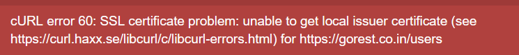

# Cogitech task

A simple website presenting an example solution of the given task.


Contents
========
* [Technologies](#technologies)
* [Get started](#get-started)
* [Usage](#usage)
* [Usage examples](#usage-examples)

## Technologies
* [php 8.1](https://www.php.net/)
* [Symfony 5](https://symfony.com/doc/current/setup.html)
* [Bootstrap](https://getbootstrap.com/)

## Get started
1. Download the [latest version](https://github.com/kabix09/ContelizerTask)

2. Install project dependencies with [`composer`](https://getcomposer.org/)
    * `$ composer install`

3. Configure `.env` file,

   <span style="color: red">Remember to setup `GO_REST_SECRET_KEY` variable!!!</span>

## Usage
To start the server, from command line simply run:
```shell script
$ symfony server:start
```

Finally use a browser to check whether the website is running:
```
http://localhost:8000
```
That's it!

## Usage examples
To get the user list:
```
http://localhost:8000/user
```

To get the user's posts:
```
http://localhost:8000/user/${user_id}/posts
```

To check the list of users with a given name
```
http://localhost:8000/user/${username}
```

## Troubleshooting

### 1. cURL cert problem


To solve this error check this page and follow the steps:
 - [github.com](https://github.com/guzzle/guzzle/issues/1935)
 - [stackoverflow.com: curl 60 ssl certificate problem](https://stackoverflow.com/questions/24611640/curl-60-ssl-certificate-problem-unable-to-get-local-issuer-certificate)